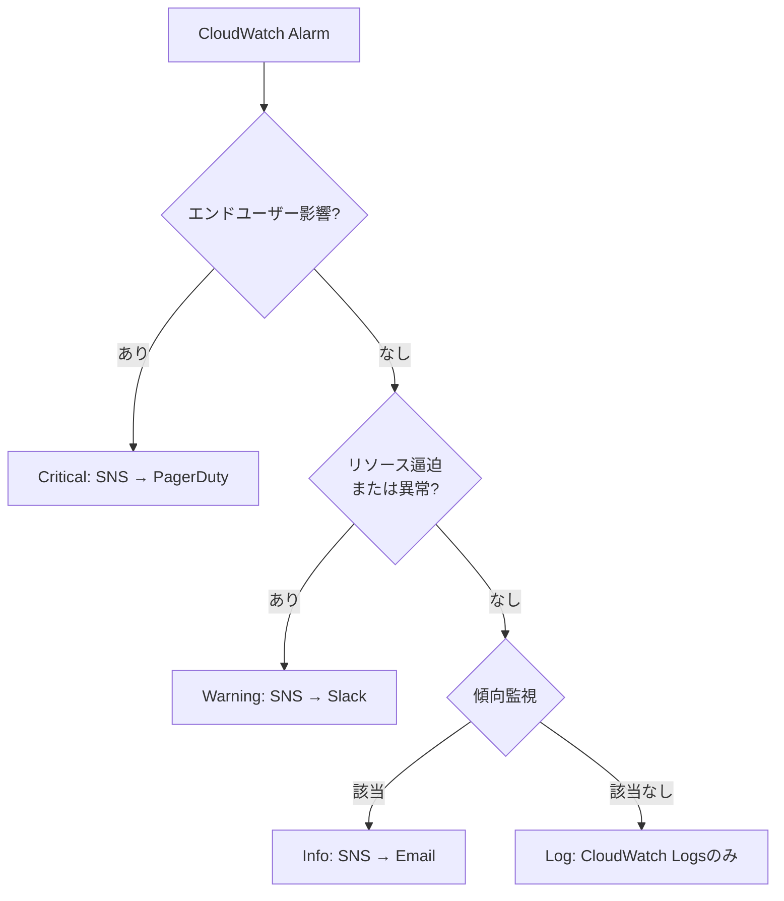

# ユーザー視点のアラート分類

アラートは「誰のために設計するか」という視点で分類することが重要です。

## なぜエンドユーザー視点が重要か

システムはエンドユーザーに価値を届けるために存在します。そのため、アラート設計においても**エンドユーザーへの影響を最優先に考える**ことが本質的に重要です。

### エンドユーザーとは

ここでいうエンドユーザーには、以下が含まれます:

1. **人間のユーザー**: Webアプリケーションやモバイルアプリの利用者
2. **システム間連携**: APIを呼び出す他システム、マイクロサービス間の通信
3. **バッチ処理の依存元**: 定期実行されるジョブの結果を待つ他プロセス

### エンドユーザー視点の利点

- **優先順位が明確になる**: 影響度に応じた対応順序を判断できる
- **過剰なアラートを防ぐ**: エンドユーザーに影響がないものは通知レベルを下げられる
- **ビジネス価値と直結**: システムの健全性とビジネス成果を結びつけられる

## アラート対象による分類

### 1. エンドユーザー影響に関するアラート

エンドユーザーのサービス利用に直接影響する事象に関するアラートです。

**対象となる事象:**

- サービス全体の停止
- レスポンスタイムの著しい悪化
- データの欠損・不整合
- 重要機能の障害

**特徴:**

- 最優先で対応が必要
- ビジネスインパクトが大きい
- SLO/SLA違反につながる可能性が高い

**アラート例:**

- API Gatewayの500エラー
- ALBのヘルスチェック失敗
- RDSの接続エラー

### 2. システム健全性に関するアラート

システムの健全性やパフォーマンスに関するアラートで、エンドユーザーへの影響が顕在化する前に検知するものです。

**対象となる事象:**

- リソース使用率の上昇（影響が出る前の段階）
- バッチ処理の失敗
- ログの異常パターン
- セキュリティイベント
- システム設定の変更

**特徴:**

- エンドユーザーへの影響が顕在化する前に検知
- 予防的な対応が可能
- システム改善のための情報源

**アラート例:**

- EC2のCPU使用率が継続的に高い
- S3バケットの容量増加トレンド
- CloudWatch Logsのエラーパターン検出

## 分類による設計の違い

| アラート対象 | エンドユーザー影響 | システム健全性 |
|-------------|-------------------|----------------|
| **優先度** | 高（Critical） | 中（Warning）〜低（Info） |
| **通知手段** | PagerDuty、電話 | Slack、メール |
| **通知先** | オンコールエンジニア | 開発・運用チーム |
| **反応時間** | 即時 | 週次/月次レビュー時 |
| **詳細レベル** | 影響範囲 | 技術的詳細 |

### 優先度の考え方

- **高（Critical）**: エンドユーザーに影響がある、または影響が出る直前
- **中（Warning）**: システムの健全性に問題があり、放置するとCriticalになる可能性がある
- **低（Info）**: 情報共有や傾向把握のため、即座の対応は不要
- **記録のみ（Log）**: 通知不要（CloudWatch Logsに記録）

## 設計時のポイント

### 1. 受信者を明確にする

各アラートについて「誰が受け取るべきか」を明確にします。

**SNSトピックの分類例:**

- Critical: オンコールエンジニア向け
- Warning: 運用チーム向け
- Info: 開発チーム全体向け

### 2. 通知内容を最適化する

受信者に応じて必要な情報を含めます。

**エンドユーザー影響アラートの通知内容:**

- エラーメッセージ
- 影響範囲
- CloudWatch Logsへのリンク
- ランブックへのリンク

**システム健全性アラートの通知内容:**

- リソース使用状況
- トレンド情報
- 対応の緊急度
- 関連ドキュメントへのリンク

### 3. エスカレーションパスを設計する

## まとめ

- システムはエンドユーザーに価値を届けるために存在する
- アラートは対象（エンドユーザー影響 or システム健全性）で分類・設計する
- エンドユーザー影響のあるアラートは最優先（Critical）
- システム健全性のアラートで予兆段階の検知も重要（Warning/Info）
- 優先度に応じて通知手段と反応時間を設定する
- 受信者に応じて通知内容を最適化する
